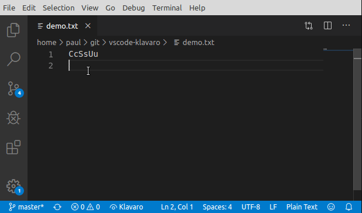

# Klavaro

## Features

Klavaro extension will replace text written in x-system with Esperanto alphabet as you type.

As an example, if you type `cx`, these two characters will be replaced by `ĉ`.

Upper case will follow the main character. For instance, `Cx` will be replaced by `Ĉ`.

Use the `Klavaro` button on the left side of the status bar to activate or deactivate the extension.

## Extension Settings

This extension contributes the following settings:

* `klavaro.activated`: activate/deactivate this extension. By default `true`.
* `klavaro.showButton`: show/hide a status bar item to activate/deactivate the extension. This item basically change `klavaro.activated` option on the run. By default `true`.

This extension uses global settings only.
